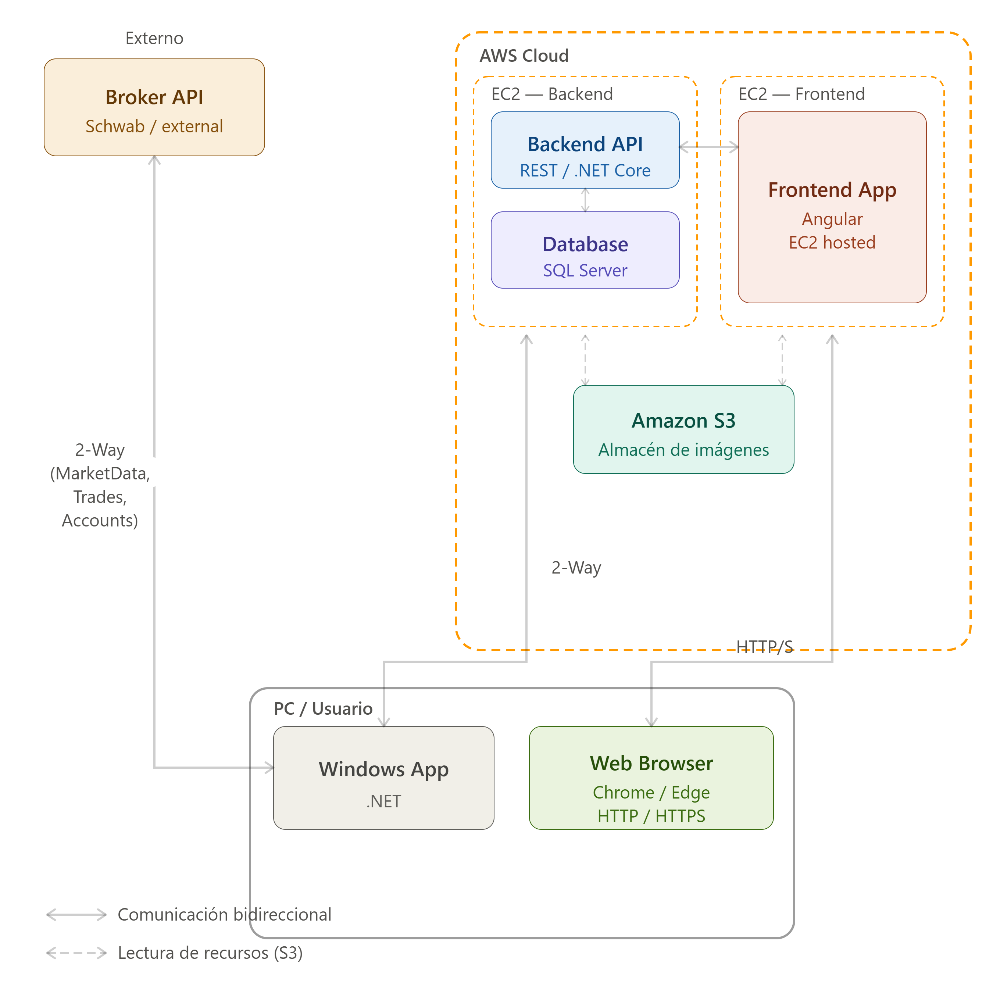

# Options Trader

Documentación completa y detallada del proyecto. Para el detalle técnico de cada funcionalidad ver [`docs/FUNCIONALIDADES.md`](docs/FUNCIONALIDADES.md); para la guía de uso paso a paso ver [`docs/GUIA_USUARIO.md`](docs/GUIA_USUARIO.md).

---

## Origen y motivación del proyecto

Este proyecto nace de una necesidad real detectada en una academia de trading de opciones en Miami, EE.UU., donde estudiantes e instructores envían sus órdenes al broker a través de una app móvil. En ese flujo, desde que el trader decide entrar hasta que la orden efectivamente se envía al mercado, pasan **no menos de 20 segundos** — tiempo suficiente para que el precio real de entrada difiera considerablemente del precio observado al momento de tomar la decisión. En algunos casos, el precio ya se ha movido lo suficiente como para alcanzar la salida planificada antes de siquiera completarse la entrada.

Para resolver esto se desarrolló esta **aplicación de escritorio Windows**: todo el proceso que en el móvil toma ~20 segundos aquí se completa en **menos de 3 segundos** — desde el envío de la orden, la confirmación vía HTTP, hasta la actualización del precio de salida. Los pasos que normalmente requieren intervención manual para introducir datos ya están predeterminados en la app, lo que le ahorra tiempo valioso al trader. **Ese es el principal valor del programa: ahorro de tiempo y lograr entrar al precio más cercano posible al que existía en el momento de la decisión.** Además, el programa monitorea la posición en tiempo real y la muestra visualmente.

Lo que comenzó como una necesidad puntual para enviar órdenes a un broker específico escaló hacia una plataforma completa: se sumaron una **API** para persistencia de información y un **frontend en Angular** para llevar el histórico de posiciones y sus estadísticas. Hoy el sistema puede usarse para estudiar y practicar las estrategias enseñadas en la academia, enviar trades reales y llevar la estadística de resultados.

Esta plataforma será presentada en una demostración a la academia para evaluar el interés y valor que le encuentren, con miras a continuar el desarrollo — incluyendo soporte para otros brokers (actualmente solo está implementado **Charles Schwab**) y cualquier otra necesidad a nivel de backend/frontend que surja.

---

## a. Descripción general del proyecto

Options Trader es un sistema de trading de opciones intradía compuesto por tres componentes:

- **App de escritorio WinForms** — cotizaciones de opciones en tiempo real (polling a Schwab), ejecución de órdenes (simuladas o reales) y registro de operaciones.
- **API ASP.NET Core** — capa central de negocio y datos: autenticación de usuarios, y persistencia de trades y screenshots.
- **Frontend Angular** (repo aparte `options-trader-web`) — visualización de solo lectura del historial de trades.

La WinForms habla **directamente con la API de Schwab** para datos de mercado y ejecución de órdenes; no pasa por la API propia. La API ASP.NET Core se usa solo para **login** y para **guardar trades y screenshots** en base de datos / S3.



> **Nota sobre el alcance de la evaluación (TFM):** independientemente de que se ha construido una plataforma completa de trading de opciones — backend, frontend, API y recursos Cloud en AWS (EC2, SQL Server, S3) —, se propone que **BigSchool evalúe como TFM únicamente la aplicación de escritorio Windows (WinForms)**, ya que revisar la plataforma completa sería excesivamente laborioso y consumiría demasiado tiempo. El sistema completo puede probarse igualmente (ver sección f para las credenciales), pero la evaluación debería enfocarse en la Windows App.

---

## b. Stack tecnológico utilizado

| Capa | Tecnología |
|---|---|
| Escritorio | WinForms (.NET 8) |
| API | ASP.NET Core 8 |
| Base de datos | SQL Server (AWS) vía Entity Framework Core |
| Autenticación | JWT Bearer + BCrypt |
| Broker | Schwab Market Data + Trader API (OAuth2) |
| Screenshots | AWS S3 |
| Frontend | Angular (repo `options-trader-web`) |
| Sincronización de tipos | Swagger + NSwag (DTO → TypeScript) |
| Desarrollo asistido por IA | Claude Code Pro — modelo Sonnet 5, esfuerzo de razonamiento Low/Medium |

---

## c. Información sobre su instalación y ejecución

Requisitos: **.NET 8 SDK**, SQL Server accesible (connection string en `appsettings.json` de `OptionsTrader.API`), y credenciales de Schwab (se configuran desde la app, pestaña Settings).

```bash
# Compilar toda la solución
dotnet build OptionsTrader.slnx

# Aplicar migraciones EF Core (crea/actualiza la base de datos)
dotnet ef database update --project OptionsTrader.Infrastructure --startup-project OptionsTrader.API

# Correr la API
dotnet run --project OptionsTrader.API

# Correr la app de escritorio (requiere la API corriendo para el login)
dotnet run --project OptionsTrader.WinForms
```

Al abrir la WinForms se muestra primero una ventana de **login** (ver sección f); luego, en la pestaña **Settings**, se configuran las credenciales de Schwab, cuentas del broker, tickers y demás ajustes (ver [`docs/GUIA_USUARIO.md`](docs/GUIA_USUARIO.md)).

---

## d. Estructura del proyecto

Clean Architecture con separación estricta de capas:

```
OptionsTrader.sln
├── OptionsTrader.Domain          — Entidades puras (Trade, Screenshot, BrokerSetting, User)
├── OptionsTrader.Application     — Casos de uso, interfaces, DTOs
├── OptionsTrader.Infrastructure  — EF Core, cliente Schwab, almacenamiento S3
├── OptionsTrader.API             — Controllers ASP.NET Core, JWT, Swagger
└── OptionsTrader.WinForms        — UI de escritorio (login, polling, trades, screenshots)
```

**Dirección de dependencias:** `Domain ← Application ← Infrastructure ← API / WinForms`

---

## e. Funcionalidades principales

- **Login** con usuario/contraseña validado contra la base de datos (5 usuarios fijos, mismo rol).
- **Cotizaciones de opciones en tiempo real** (polling a Schwab), con doble grid (expiración actual y siguiente), filtros por rango/Counts/CALL-PUT.
- **Ejecución de trades**: modo simulado (`No Trade`), o real vía Schwab (`Trade` / `Trade-Target`), con confirmación obligatoria y sincronización con el precio real de llenado.
- **Trades y screenshots asociados al usuario logueado**: cada trade queda ligado al usuario que lo creó (derivado del JWT, nunca del cliente); cada usuario solo ve y puede cerrar sus propios trades.
- **Screenshots automáticos** de cada apertura/cierre de operación, subidos a S3 y asociados al trade.
- **Registro para backtesting**: CSV de cotizaciones (con griegos e IV) y snapshot diario de IV de apertura para IV Rank/Percentile propio.
- **Automatización por horario de mercado**: arranque diferido, reducción de cadencia después de las 11 AM, auto-captura de cierre a las 3:55 PM.

Ver [`docs/FUNCIONALIDADES.md`](docs/FUNCIONALIDADES.md) para el detalle completo de cada una.

---

## f. Usuario y contraseña de prueba

El sistema tiene 5 usuarios fijos sembrados en la base de datos (`user1` a `user5`), todos con el mismo rol y la misma contraseña de prueba:

| Usuario | Contraseña | Uso |
|---|---|---|
| `user1` | `Pass1234!` | Usuario de prueba del desarrollador — en el frontend se muestran sus trades y actividad. |
| `user2` | `Pass1234!` | Usuario de prueba para que BigSchool use la aplicación e inyecte datos de prueba a la base de datos. |

*(`user2`–`user5` usan la misma contraseña; sirven para distinguir sesiones simultáneas, no roles distintos.)*
