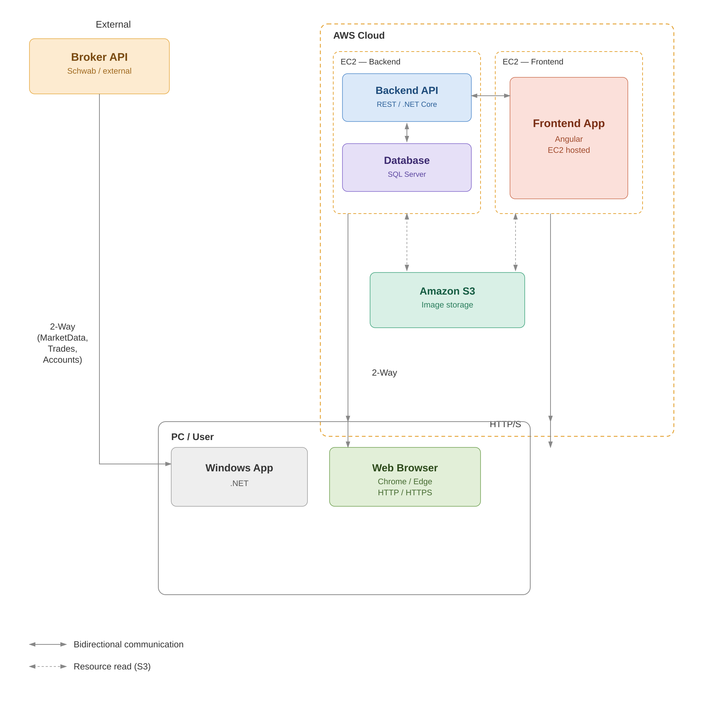

# Options Trader

Complete and detailed documentation of the project. For the technical detail of each feature see [`docs/FEATURES.md`](docs/FEATURES.md); for the step-by-step usage guide see [`docs/USER_GUIDE.md`](docs/USER_GUIDE.md); for the PowerPoint presentation see [`docs/OptionsTrader_Presentacion.pptx`](docs/OptionsTrader_Presentacion.pptx).

---

## Project origin and motivation

This project was born from a real need identified at an options trading academy in Miami, USA, where students and instructors send their orders to the broker through a mobile app. In that flow, from the moment the trader decides to enter until the order is actually sent to the market, **no less than 20 seconds** go by — enough time for the actual entry price to differ considerably from the price observed at the moment the decision was made. In some cases, the price has already moved enough to reach the planned exit before the entry is even completed.

To solve this, this **Windows desktop application** was developed: the whole process that takes ~20 seconds on mobile is completed here in **under 1 second** — from sending the order, to HTTP confirmation, to updating the exit price. The steps that normally require manual intervention to enter data are already predetermined in the app, which saves the trader valuable time. **That is the program's main value: saving time and managing to enter at the price closest to the one that existed at the moment of the decision.** In addition, the program monitors the position in real time and displays it visually.

What started as a specific need to send orders to a particular broker grew into a complete platform: an **API** was added for data persistence, along with an **Angular frontend** to track position history and its statistics. Today the system can be used to study and practice the strategies taught at the academy, send real trades, and keep track of result statistics.

This platform will be presented in a demo to the academy to gauge the interest and value they see in it, with a view to continuing development — including support for other brokers (currently only **Charles Schwab** is implemented) and any other backend/frontend need that comes up.

---

## a. General project description

Options Trader is an intraday options trading system made up of three components:

- **WinForms desktop app** — real-time options quotes (polling Schwab), order execution (simulated or real), and trade logging.
- **ASP.NET Core API** — central business and data layer: user authentication, and persistence of trades and screenshots.
- **Angular frontend** (separate repo `options-trader-web`) — read-only visualization of trade history.

The WinForms app talks **directly to the Schwab API** for market data and order execution; it does not go through the in-house API. The ASP.NET Core API is only used for **login** and to **save trades and screenshots** to the database / S3.



> **Note on evaluation scope (TFM/master's thesis):** regardless of the fact that a complete options trading platform has been built — backend, frontend, API, and Cloud resources on AWS (EC2, SQL Server, S3) — it is proposed that **BigSchool evaluate as the TFM only the Windows desktop application (WinForms)**, since reviewing the entire platform would be excessively laborious and time-consuming. The complete system can equally be tested (see section f for credentials), but the evaluation should focus on the Windows App.

---

## b. Technology stack used

| Layer | Technology |
|---|---|
| Desktop | WinForms (.NET 8) |
| API | ASP.NET Core 8 |
| Database | SQL Server (AWS) via Entity Framework Core |
| Authentication | JWT Bearer + BCrypt |
| Broker | Schwab Market Data + Trader API (OAuth2) |
| Screenshots | AWS S3 |
| Frontend | Angular (repo `options-trader-web`) |
| Type synchronization | Swagger + NSwag (DTO → TypeScript) |
| AI-assisted development | Claude Code Pro — Sonnet 5 model, Low/Medium reasoning effort |

---

## c. Installation and running instructions

Requirements: **.NET 8 SDK**, accessible SQL Server (connection string in `appsettings.json` of `OptionsTrader.API`), and Schwab credentials (configured from the app, Settings tab).

```bash
# Build the entire solution
dotnet build OptionsTrader.slnx

# Apply EF Core migrations (creates/updates the database)
dotnet ef database update --project OptionsTrader.Infrastructure --startup-project OptionsTrader.API

# Run the API
dotnet run --project OptionsTrader.API

# Run the desktop app (requires the API running for login)
dotnet run --project OptionsTrader.WinForms
```

When the WinForms app opens, a **login** window is shown first (see section f); then, on the **Settings** tab, you configure Schwab credentials, broker accounts, tickers, and other settings (see [`docs/USER_GUIDE.md`](docs/USER_GUIDE.md)).

> **Note on API credentials:** to run the app with real data and orders, 4 sensitive values are needed that are **not included in this repository** (Schwab API Key, Schwab API Secret, AWS Access Key, and AWS Secret Key). The linked Schwab accounts operate with **real money**, so these credentials are only shared upon direct request and are not published anywhere. If it is strictly necessary to run the application end-to-end during the evaluation, **please request them by email** and they will be sent privately (not via chat or any public channel). Without these credentials, the code, architecture, and the rest of the documentation (including the demo videos) can still be reviewed without restriction.

---

## d. Project structure

Clean Architecture with strict layer separation:

```
OptionsTrader.sln
├── OptionsTrader.Domain          — Pure entities (Trade, Screenshot, BrokerSetting, User)
├── OptionsTrader.Application     — Use cases, interfaces, DTOs
├── OptionsTrader.Infrastructure  — EF Core, Schwab client, S3 storage
├── OptionsTrader.API             — ASP.NET Core controllers, JWT, Swagger
└── OptionsTrader.WinForms        — Desktop UI (login, polling, trades, screenshots)
```

**Dependency direction:** `Domain ← Application ← Infrastructure ← API / WinForms`

---

## e. Main features

- **Login** with username/password validated against the database (5 fixed users, same role); remembers the last username used (never the password) and shows the logged-in user's name in the status bar.
- **Real-time options quotes** (polling Schwab), with a dual grid (current and next expiration), filters by range/Counts/CALL-PUT.
- **Trade execution**: simulated mode (`No Trade`), or real via Schwab (`Trade` / `Trade-Target`), with mandatory confirmation and synchronization with the actual fill price.
- **Trades and screenshots tied to the logged-in user**: each trade is linked to the user who created it (derived from the JWT, never from the client); each user only sees and can close their own trades.
- **Automatic screenshots** of every trade opening/closing, uploaded to S3 and associated with the trade.
- **Backtesting logging**: CSV of quotes (with greeks and IV) and a daily opening-IV snapshot for a custom IV Rank/Percentile.
- **Market-hours automation**: delayed startup, reduced polling cadence after 11 AM, automatic close capture at 3:55 PM.
- **Live Chart** (popup and embedded **Charts** tab): live chart with automatic signal detection (Floor/Ceiling, Demand/Supply Zones, T-Line, Bollinger), manual drawing tools, and a Daily view with a reference SMA.
- **Simulator**: offline practice mode that replays already-captured market data, with the same automatic analyses as the Live Chart, with no connection or real risk.
- **Reinforcement**: when opening a 2nd Demo trade on the same strike/type as one already open, a 3rd averaged trade is automatically created (contracts summed, weighted average price) that is monitored and closed together with the other two.

See [`docs/FEATURES.md`](docs/FEATURES.md) for the complete detail of each one.

---

## f. Test username and password

The Angular frontend (read-only, trade traceability) is deployed at: **http://3.133.58.172/**

The system has 5 fixed users seeded in the database (`user1` through `user5`), all with the same role and the same test password:

| User | Password | Use |
|---|---|---|
| `user1` | `Pass1234!` | Developer's test user — the frontend shows their trades and activity. |
| `user2` | `Pass1234!` | Test user for BigSchool to use the application and inject test data into the database. |

*(`user2`–`user5` use the same password; they exist to distinguish simultaneous sessions, not different roles.)*

---

## g. Steps for the evaluator — running the Windows App on their PC

**Prerequisites**
1. Install [.NET 8 SDK](https://dotnet.microsoft.com/download/dotnet/8.0)
2. Have Git installed

**Steps**
1. Clone the repository:
   ```bash
   git clone https://github.com/ironbert2025/options-trader-backend.git
   cd options-trader-backend
   ```
2. Build the solution:
   ```bash
   dotnet build OptionsTrader.slnx
   ```
3. Run the desktop application:
   ```bash
   dotnet run --project OptionsTrader.WinForms
   ```
4. In the **login** window, enter:
   - User: `user2`
   - Password: `Pass1234!`

   (This is the test user specifically intended for the evaluation — see section f.)
5. The app connects automatically to the API already deployed on AWS — nothing else needs to be run locally.

**Important note:** to see real-time quotes and test order submission (Quotes tab, trade execution), the app needs Schwab API credentials loaded in the **Settings** tab. Those credentials correspond to an account with real money and are **not included in the repository** (see section c) — if it is necessary to test that full flow, they must be requested by email. Without those credentials, the UI, configuration, login, and the rest of the documentation and demo videos can still be reviewed without restriction.

**Note on market hours:** the application queries real-time data from the Schwab API, which only responds with valid quotes during US market hours (**Monday to Friday, 9:30 AM – 4:00 PM ET**). If run outside those hours (weekends or after hours on business days), the Quotes tab may show a `400 Bad Request` error when trying to fetch quotes — this is expected and does not indicate an application failure. To test the full quotes and trades flow, it is recommended to do so during market hours.

Outside those hours it can still be reviewed without restriction: the build and code structure, the Settings tab and its configuration, the login, the frontend with the trade history (section f), all the documentation (`docs/FEATURES.md`, `docs/USER_GUIDE.md`), and the demo videos ([`docs/VIDEO_SCRIPT_TFM.md`](docs/VIDEO_SCRIPT_TFM.md)), which already show the complete flow recorded during market hours.
