# Secuencia de envío de orden desde la app móvil (thinkorswim)

Este documento muestra, paso a paso, el flujo real que sigue un trader al enviar una orden de opciones desde la app móvil del broker (thinkorswim by Schwab). Es el mismo flujo descrito en la sección **"Origen y motivación del proyecto"** del [`README.md`](../README.md): desde que el trader decide entrar hasta que la orden efectivamente se envía al mercado pasan **no menos de 20 segundos**, tiempo suficiente para que el precio se mueva de forma significativa respecto al observado al momento de la decisión.

Esta es precisamente la razón de ser de la **Windows App** de este proyecto: automatizar y comprimir este mismo flujo a **menos de 3 segundos**.

📹 **Video de la secuencia completa (~20 segundos):** *(pendiente — se agregará el link a Google Drive una vez subido el video)*

---

## Paso a paso

### 1. Pantalla de inicio del móvil
Localizar el ícono de la app thinkorswim entre las demás apps del teléfono.

### 2. Login en la app
Autenticación con Login ID y Face ID.

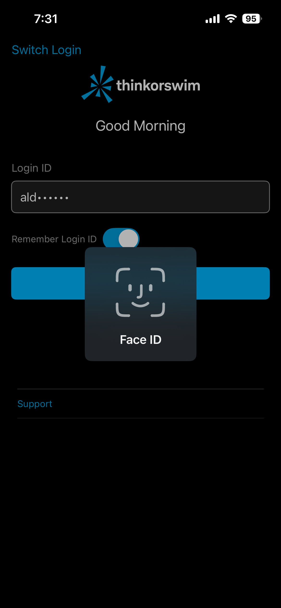

### 3. Selección de cuenta
Elegir la cuenta sobre la que se operará (paperMoney o Live Trading), entre las cuentas vinculadas.

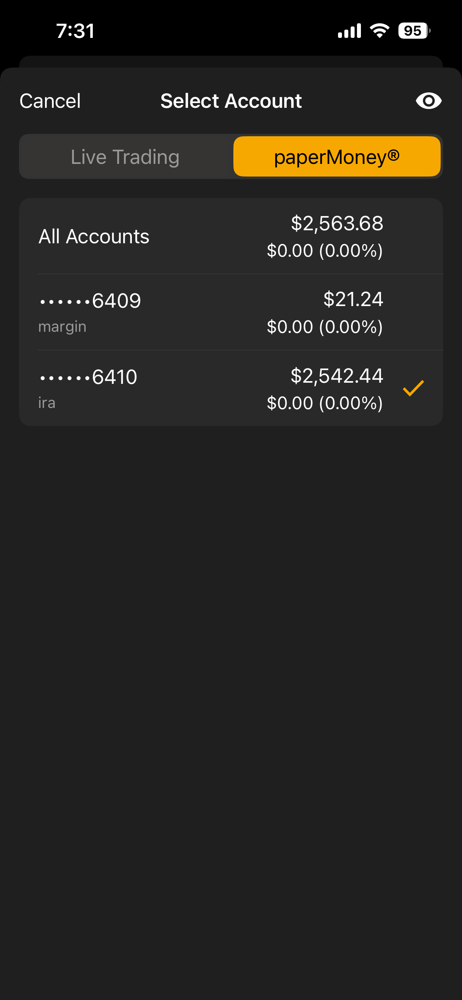

### 4. Overview de la cuenta
Revisar el estado de la cuenta (posiciones, Net Liq) antes de operar.

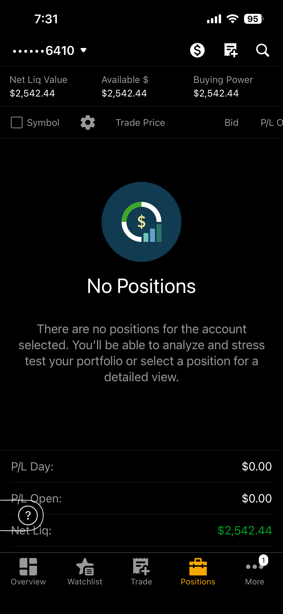

### 5. Búsqueda del símbolo
Buscar el ticker a operar (por ejemplo SPY) en el buscador de símbolos.

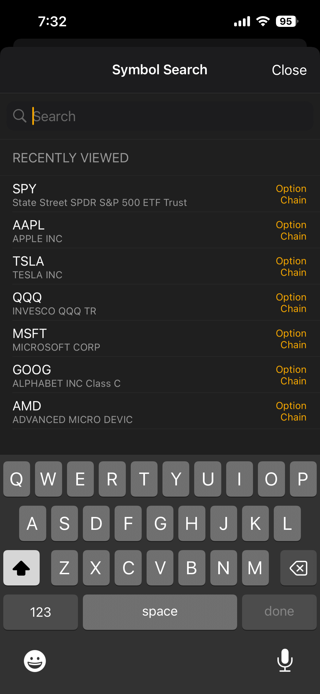

### 6. Detalle del símbolo y cadena de opciones
Ver el precio spot, Bid/Ask e IV del subyacente, y las fechas de expiración disponibles.

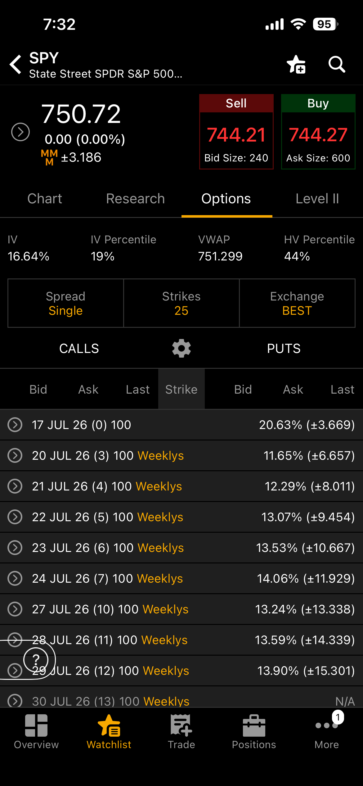

### 7. Selección del strike
Elegir el strike y tipo de opción (Call/Put) dentro de la cadena de opciones (option chain).

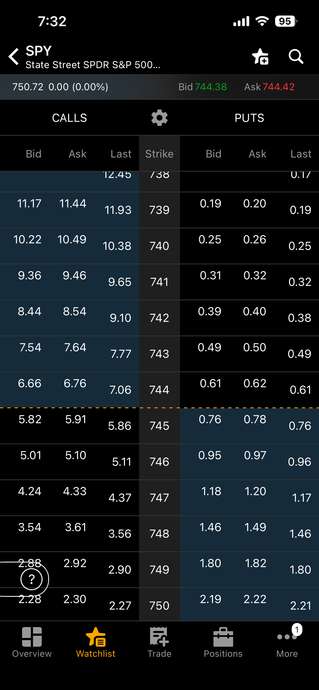

### 8. Armado de la orden
Configurar tipo de orden (Limit/Market), cantidad y revisar el costo estimado del trade.

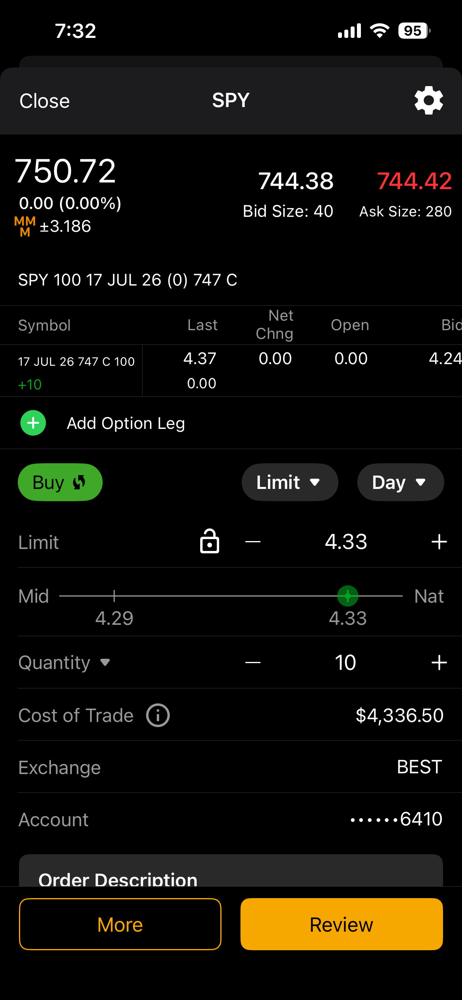

### 9. Ajuste final antes de revisar
Confirmar cantidad, tipo de orden a mercado y cuenta antes de pasar a revisión.

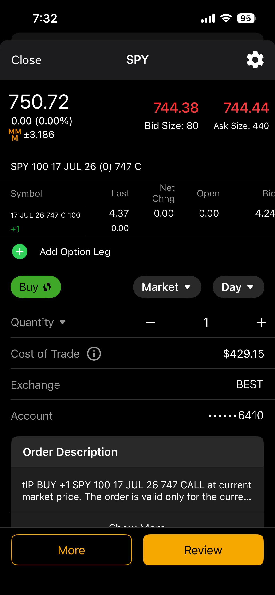

### 10. Confirmación de la orden simulada
Pantalla de confirmación con el detalle completo: costo del trade, break-even, máxima ganancia/pérdida y efecto en el buying power.

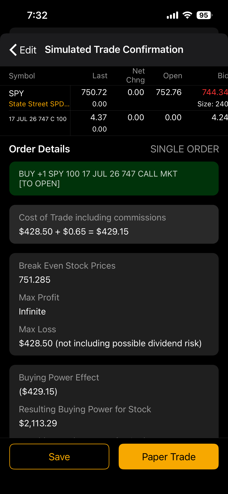

### 11. Orden ejecutada (Filled)
Verificar en el historial de órdenes del día que la orden fue ejecutada (Filled) y a qué precio.

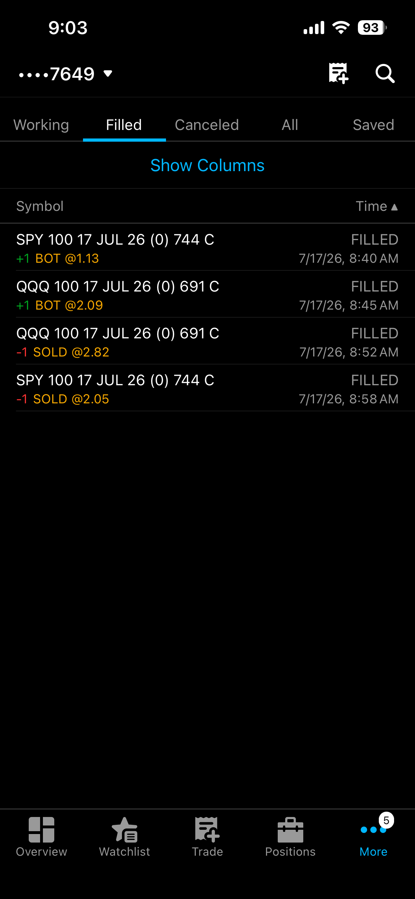

### 12. Resumen de cuenta post-operación
Revisar el resumen de la cuenta (P/L del día, posiciones activas, órdenes) luego de operar.

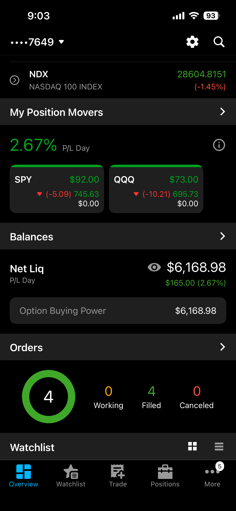

---

## Comparación con la Windows App

| | App móvil (thinkorswim) | Windows App (este proyecto) |
|---|---|---|
| Pasos manuales | Login → cuenta → búsqueda de símbolo → cadena de opciones → armado de orden → revisión → envío → verificación | Un clic sobre la fila del strike en el grid de cotizaciones |
| Tiempo aproximado | ~20 segundos | < 3 segundos |
| Riesgo de slippage | Alto — el precio puede moverse considerablemente durante el proceso manual | Mínimo — la orden se envía y confirma casi instantáneamente |

Ver también [`docs/FUNCIONALIDADES.md`](FUNCIONALIDADES.md) y [`docs/GUIA_USUARIO.md`](GUIA_USUARIO.md) para el detalle del flujo equivalente en la Windows App.
